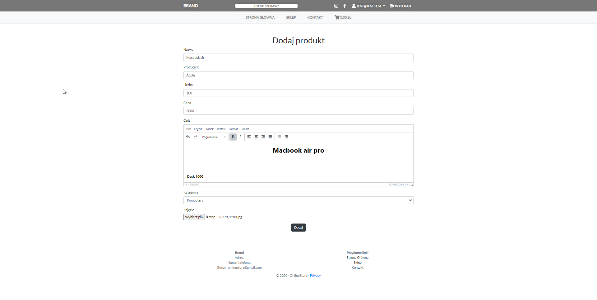
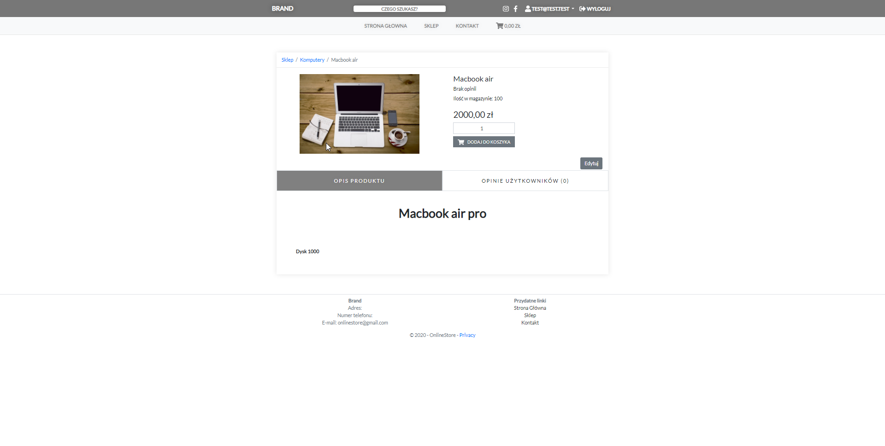
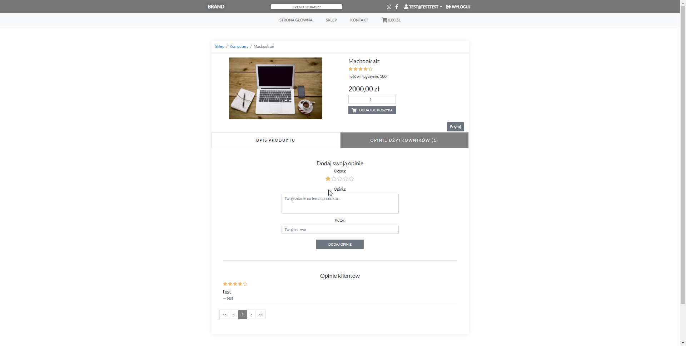
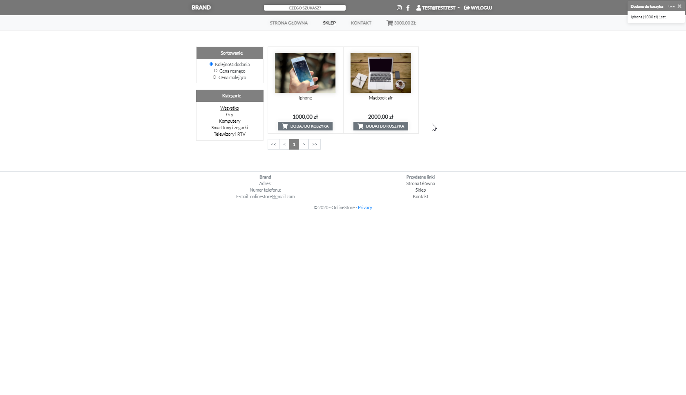
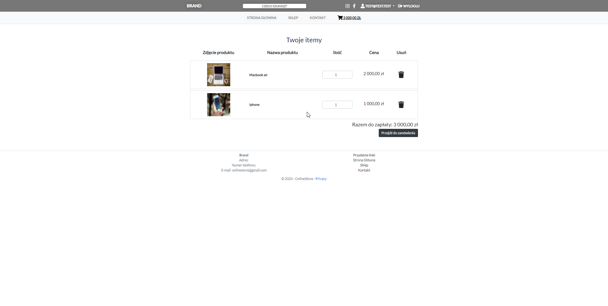
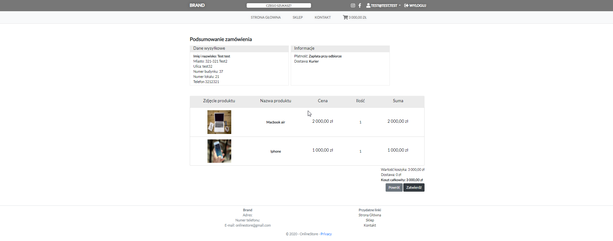
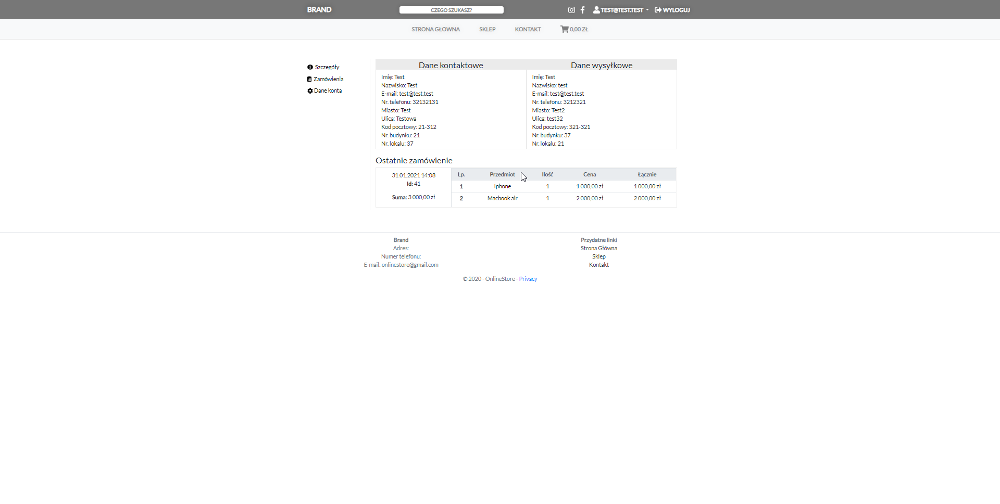
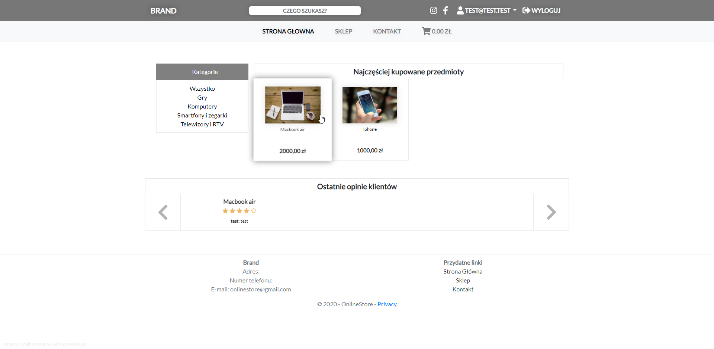

# Overview

It is a simple on-line store project created with ASP.NET Core MVC. We had only 4 weeks to create it, thus it doesn't include any advanced sorting or etc.
The project is integrated with Google Cloud Storage and reCAPTCHA v3.

## Installation

1. Create [MySQL database](https://hub.docker.com/_/mysql).
2. Create Google Cloud Storage, it's a nice tutorial [here](https://medium.com/net-core/using-google-cloud-storage-in-asp-net-core-74f9c5ee55f5) for that.
3. Create [reCAPTCHA v3](https://www.google.com/recaptcha/about/).
4. Clone this repository to your computer.
```
git clone https://github.com/bartlomiejkwiatkowski/ASP.NET-Core---online-store.git
```
5. Create connection string for your MySQL database.
```
server=ip_here;port=port_here;database=database_name_here;user=user_here;password=password_here;Convert Zero DateTime=true;AllowZeroDateTime=true;
```
6. Rename your JSON file downloaded from Google Cloud Storage to online-store-credential.json and put it into main folder.
7. Replace settings with your values.
```
{
  "ConnectionStrings": {
    "DefaultConnection": ""
  },
  "RecaptchaSettings": {
    "SecretKey": "",
    "SiteKey": ""
  },
  "GoogleCloudSettings": {
    "CredentialFile": "online-store-credential.json",
    "StorageBucket": ""
  },
  "Logging": {
    "LogLevel": {
      "Default": "Information",
      "Microsoft": "Warning",
      "Microsoft.Hosting.Lifetime": "Information"
    }
  }
}
```
8. The project doesn't have any docker integration and because of that, you can run it for example in Visual Studio or by ```dotnet watch run``` command. You can also build it manually.

## Images








